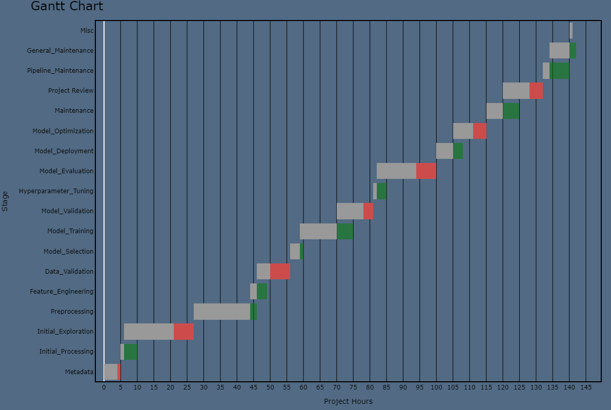

---

# Gantt Chart Generator 

---

## Example

## Table of Contents
- [Project Status](#project-status)
- [Technologies Used](#technologies-used)
- [Project Overview](#project-overview)
    - [Description](#description)
    - [Objectives](#objectives)
- [Methodology](#methodology)
    - [Problem Definition](#problem-definition)
    - [Approach and Models](#approach-and-models)
    - [Deployment](#deployment)
- [Results](#results)
- [Contribution](#contribution)
- [Contact Information](#contact-information)

## Project Status
- **Status**: Ongoing
- **Last Updated**: 20/05/2023
- **Data**: Synthetic (Please note that no actual data is used in this project)

## Technologies Used
- **Primary Programming Language**: Python 3.11
- **Dependencies**: See Libraries/dependencies.py for a full list

## Project Overview
This project provides a useful tool for effective project planning and tracking. Our Gantt chart generator can handle project stages, timing details, and compare estimated timings with actual outcomes.

### Description
The Gantt chart generator uses synthetic data (based on estimates from previous experience) to create a practical project management tool. Users can allocate time for each project stage and learn from past experiences for future planning.

### Objectives
- Develop a tool to aid in project management.
- Allow visualization of project stage timings.
- Gain practical experience using Plotly.
- Obtain insights into project stage timings.

## Methodology
This section outlines the standard data science methodology followed in this project.

### Problem Definition
The main goal is to build a tool that will help in project tracking or planning project stage timings before beginning. The Gantt chart generator will provide feedback on the effectiveness of time allocation for each project stage.

### Approach and Models
This project does not utilize predictive modeling.

### Deployment
With the use of synthetic data, the project is currently operational as expected. It will be further tested and validated in future projects as an add-on tool.

## Results
[This section should include the main findings, any figures or diagrams that illustrate the results, and a brief discussion.]

## Contribution
Feel free to suggest edits, submit issues, or clone the project for personal use.

## Contact Information
**Project Lead: [Daniel Elston](https://github.com/Daniel-Elston)**

|Name     |  GitHub Handle   |  
|---------|-----------------|
| Daniel Elston | [GitHub D. Elston](https://github.com/Daniel-Elston)   |

For any further queries or requests, please contact me. 
Email: delstonds@outlook.com  
